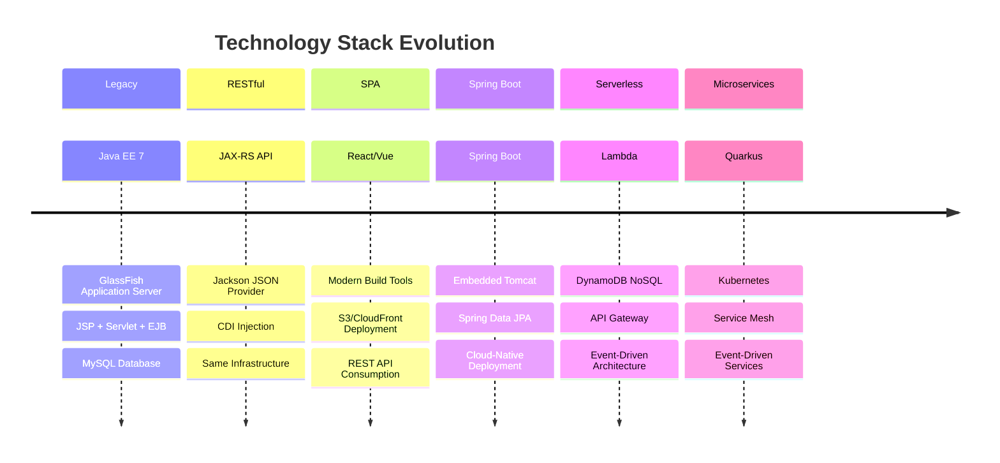
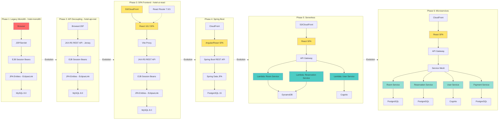
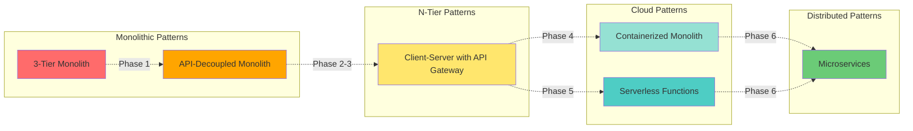
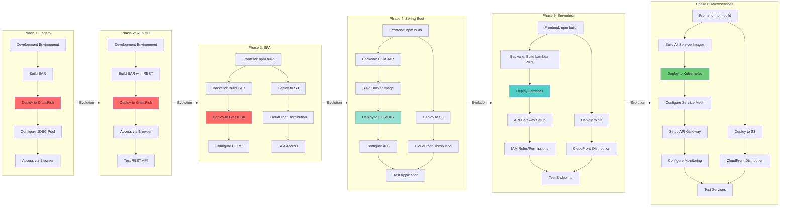
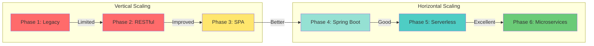

# Architecture Comparison - Hotel Reservation System

A detailed comparison of architecture patterns, technology stacks, and deployment strategies across the modernization phases.

**Document Purpose:** This document provides side-by-side comparisons of all phases for technical evaluation. It focuses on technology stacks, performance characteristics, costs, and scalability. For phase planning and execution details, see [MODERNIZATION_ROADMAP.md](./MODERNIZATION_ROADMAP.md). For decision-making guidance, see [DECISION_FRAMEWORK.md](./DECISION_FRAMEWORK.md).

## Architecture Evolution Timeline



## Architecture Patterns Comparison

### Diagram: Evolution from Monolith to Microservices



## Technology Stack Comparison

| Component | Phase 1: Legacy (hotel-monolith) | Phase 2: RESTful (hotel-api-rest) | Phase 3: SPA (hotel-ui-react) | Phase 4: Spring Boot | Phase 5: Serverless | Phase 6: Microservices |
|-----------|----------------|------------------|--------------|---------------------|---------------------|------------------------|
| **Frontend Framework** | JSP (JavaServer Pages) | JSP (unchanged) | React 18.2.0 | Angular/React | React | React |
| **Frontend Build** | JSP Compilation (Ant) | JSP Compilation (Ant) | Vite 5.0.0 | Angular CLI | Vite/Webpack | Vite |
| **Frontend Language** | Java + HTML/CSS/JS | Java + HTML/CSS/JS | TypeScript 5.0.0 | TypeScript/JavaScript | TypeScript/JavaScript | TypeScript/JavaScript |
| **Frontend Router** | N/A | N/A | React Router 7.9.5 | Angular Router/React Router | React Router | React Router |
| **Deployment** | WAR in EAR | WAR in EAR | S3 + CloudFront (planned) | CloudFront + Container | S3 + CloudFront | CloudFront |
| **API Layer** | N/A | JAX-RS (Jersey) + Jackson + CDI | JAX-RS (Jersey) - consumed | Spring MVC | Lambda Handlers | Quarkus REST |
| **Backend Framework** | EJB 3.1 | EJB 3.1 | EJB 3.1 (backend) | Spring Boot 3.x | AWS Lambda | Quarkus |
| **Business Logic** | Session Beans (RoomFacade, ReservationFacade) | Session Beans (reused) | Session Beans (via REST) | Spring Services | Lambda Functions | Microservices |
| **Data Access** | JPA 2.1 (EclipseLink) | JPA 2.1 (EclipseLink) | JPA 2.1 (via REST) | Spring Data JPA | DynamoDB SDK | Quarkus Panache |
| **Database** | MySQL 8.0 | MySQL 8.0 | MySQL 8.0 (via REST)<br><small>*Note: Phase 3.5 adds PostgreSQL 15 option*</small> | PostgreSQL 15/Aurora | DynamoDB | PostgreSQL 15/Aurora |
| **ORM/Persistence** | EclipseLink | EclipseLink | N/A (REST client) | Hibernate | AWS SDK | Hibernate (Panache) |
| **Application Server** | GlassFish 4.1.1 | GlassFish 4.1.1 | GlassFish 4.1.1 (backend) | Embedded Tomcat | N/A (Lambda) | N/A (Container) |
| **Container Platform** | DevContainer | DevContainer | DevContainer (Node.js 20+) | Docker + ECS/EKS | Lambda Runtime | Kubernetes |
| **Build Tool** | Apache Ant | Apache Ant | Vite 5.0 (frontend), Ant (backend) | Maven/Gradle | Maven/Gradle | Maven/Gradle |
| **JDK Version** | Java 8 | Java 8 | Java 8 (backend), Node.js 20+ (frontend) | Java 17+ | Java 17/21 | Java 17+ |
| **Authentication** | N/A | N/A | N/A | Spring Security | AWS Cognito | OAuth 2.0 |
| **API Documentation** | N/A | rest-test.html | ApiTestPage component | SpringDoc | API Gateway Docs | OpenAPI |
| **Service Discovery** | N/A | N/A | Vite Proxy (dev, no separate service discovery) | N/A | API Gateway | Kubernetes DNS |
| **Messaging** | N/A | N/A | N/A | JMS | EventBridge/SNS | Kafka/EventBridge |
| **Monitoring** | GlassFish Admin | GlassFish Admin | Browser DevTools | Actuator + CloudWatch | CloudWatch | Prometheus + Grafana |
| **CI/CD** | Manual | Manual | Manual (GitHub Actions planned) | GitHub Actions | GitHub Actions | ArgoCD |

## Architecture Pattern Analysis

### Pattern Evolution



## Deployment Complexity Comparison



## Scalability Comparison



## Performance Characteristics

| Metric | Phase 1: Legacy (hotel-monolith) | Phase 2: RESTful (hotel-api-rest) | Phase 3: SPA (hotel-ui-react) | Phase 4: Spring Boot | Phase 5: Serverless | Phase 6: Microservices |
|--------|----------------|------------------|--------------|---------------------|---------------------|------------------------|
| **Cold Start Time** | N/A (always running) | N/A (always running) | N/A (dev server) | 2-5s | 100-500ms | 100-300ms |
| **Warm Response Time** | 50-100ms | 50-100ms (API) | 100-200ms (with proxy) | 20-50ms | 10-50ms | 10-30ms |
| **Throughput** | Medium | Medium | Medium | High | High | Very High |
| **Latency** | Medium | Medium | Medium (proxy overhead) | Low | Low | Very Low |
| **Concurrent Users** | 100-500 | 100-500 | 500-2000 | 5,000+ | 10,000+ | 20,000+ |
| **Database Connections** | Pool (50) | Pool (50) | Pool (50, via backend) | Pool (200) | N/A (DynamoDB) | Pool per service |
| **Memory Usage** | High (1GB+) | High (1GB+) | Low (frontend only) | Medium (512MB) | Low (128MB+) | Medium (256MB/service) |
| **CPU Usage** | Medium-High | Medium-High | Low (frontend only) | Medium | Low (on-demand) | Low-Medium |
| **Bundle Size** | N/A | N/A | ~200KB (gzipped) | N/A | N/A | N/A |

## Cost Analysis (Estimated Monthly)

| Resource | Phase 1: Legacy (hotel-monolith) | Phase 2: RESTful (hotel-api-rest) | Phase 3: SPA (hotel-ui-react) | Phase 4: Spring Boot | Phase 5: Serverless | Phase 6: Microservices |
|----------|----------------|------------------|-------------|---------------------|---------------------|------------------------|
| **Compute** | EC2: $50-200 | EC2: $50-200 | EC2: $50-200 (backend) | ECS: $30-100 | Lambda: $5-50 | EKS: $150+ |
| **Storage** | EBS: $10 | EBS: $10 | S3: $1 (frontend) | EBS: $20 | S3: $1 | EBS: $50 |
| **Database** | RDS: $50 | RDS: $50 | RDS: $50 (shared backend) | RDS: $50-200 | DynamoDB: $10-50 | RDS: $200-500 |
| **CDN** | N/A | N/A | CloudFront: $10 (frontend) | CloudFront: $10 | CloudFront: $10 | CloudFront: $10 |
| **API Gateway** | N/A | N/A | N/A | N/A | $5-50 | $20-100 |
| **Load Balancer** | ELB: $20 | ELB: $20 | ALB: $25 (backend) | ALB: $25 | N/A | ALB: $50+ |
| **Monitoring** | CloudWatch: $10 | CloudWatch: $10 | CloudWatch: $15 | CloudWatch: $30 | CloudWatch: $20 | CloudWatch + Prometheus: $100+ |
| **Total Monthly** | **$140-290** | **$140-290** | **$150-300** | **$165-365** | **$50-200** | **$580-1000+** |

## Development Experience Comparison

### Setup Time

```
Legacy:         ████████████ 10 minutes (DevContainer)
RESTful:        ████████████ 10 minutes (DevContainer)
SPA:            ████████████████ 15 minutes (npm + backend)
Serverless:     ████████████████████ 30 minutes (SAM/Serverless)
Spring Boot:    ████████████████ 15 minutes (Spring Initializr)
Microservices:  ████████████████████████ 45 minutes (multiple services + K8s)
```

### Testing Complexity

```
Legacy:         ████████ Easy (servlet tests)
RESTful:        ██████████ Moderate (API tests)
SPA:            ████████████ Moderate (E2E tests)
Serverless:     ████████████████ Complex (local testing)
Spring Boot:    ██████████ Moderate (integration tests)
Microservices:  ██████████████████ Very Complex (distributed testing)
```

### Debugging Complexity

```
Legacy:         ██████ Easy (log files)
RESTful:        ██████ Easy (log files)
SPA:            ████████ Moderate (dev tools)
Serverless:     ██████████████ Difficult (CloudWatch logs)
Spring Boot:    ███████ Easy (debugger)
Microservices:  ████████████████ Very Difficult (distributed tracing)
```

## Migration Path Recommendations

### Recommended Paths by Scenario

**Scenario 1: Limited Budget, Low Risk**
```
Phase 1 (Baseline) → Phase 2 (RESTful API) → Phase 3 (SPA Frontend)
```
*Minimal infrastructure changes, gradual UX improvement*

**Scenario 2: Enterprise Standard Stack**
```
Phase 1 (Baseline) → Phase 2 (RESTful API) → Phase 4 (Spring Boot)
```
*Industry-standard, large community, proven patterns*

**Scenario 3: Cloud-Native, Pay-per-Use**
```
Phase 1 (Baseline) → Phase 2 (RESTful API) → Phase 5 (Serverless)
```
*Optimal for variable workloads, minimal operational overhead*

**Scenario 4: Maximum Scalability**
```
Phase 1 (Baseline) → Phase 2 (RESTful API) → Phase 6 (Microservices)
```
*Best for large-scale applications with multiple teams*

**Scenario 5: Complete Modernization**
```
Phase 1 → Phase 2 → Phase 3 → Phase 4 → Phase 5 → Phase 6
```
*Demonstrates full range of architectural patterns (Portfolio)*

## Conclusion

Each phase represents a valid modernization strategy with different trade-offs. The choice depends on:
- **Business objectives** (cost, scalability, developer experience)
- **Team capabilities** (existing skills, learning capacity)
- **Time constraints** (aggressive vs gradual migration)
- **Infrastructure** (existing investments, cloud strategy)
- **Risk tolerance** (incremental vs big-bang approach)

This portfolio demonstrates all paths, providing comprehensive examples of modern software architecture.

